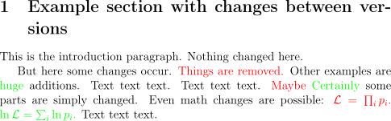

Create a LaTeX-compilable diff of two LaTeX files.

The main purpose is to produce diffs for documents in the [CMS TDR document repository](https://twiki.cern.ch/twiki/bin/view/CMS/Internal/TdrProcessing), but it can also be used for any other LaTeX document.

No real LaTeX parsing is performed (and there is no intention to implement this), so the resulting diff file might contain errors that need to be fixed by hand.

Copyright 2018 Johannes Lange (see LICENSE.txt)

## Installation
- requires python3 and simplediff

- install development version from git:
```
git clone git@github.com:jolange/latex_diff.git
pip install [-e] .
```

## Usage
- note that your LaTeX document has to use the `xcolor` package to display the diff markup



### `latex_diff`
```ShellSession
$ latex_diff -h
usage: latex_diff [-h] FILE_OLD FILE_NEW

positional arguments:
  FILE_OLD
  FILE_NEW

optional arguments:
  -h, --help  show this help message and exit
```
- example usage of the `latex_diff` executable:
```ShellSession
$ latex_diff example1_old.tex example1_new.tex > example1_diff.tex
$ pdflatex example1_diff.tex
```

### `tdr_diff`
```ShellSession
$ tdr_diff -h
usage: tdr_diff [-h] SRC REV_OLD REV_NEW

positional arguments:
  SRC         LaTeX source directory in the TDR repository. E.g. "~/cms-
              docs/papers/TOP-XX-YYY/trunk/TOP-XX-YYY.tex" or "TOP-XX-YYY.tex"
  REV_OLD     Older SVN revision to compare (e.g. 466700)
  REV_NEW     Newer SVN revision to compare (e.g. 466702) or HEAD for the
              latest revision

optional arguments:
  -h, --help  show this help message and exit
```
- example usage of the `tdr_diff` executable:
```ShellSession
$ pwd
/path/to/cms-docs/notes/TOP-XX-YYY/trunk
$ tdr_diff TOP-XX-YYY.tex 123456 123457
[... will check out and copy the versions ...]

Written diff version to "/tmp/tdr_tmp_js3fz1re/diff"
Compile it there, then delete the temporary directory "/tmp/tdr_tmp_js3fz1re"
$ cd /tmp/tdr_tmp_js3fz1re/diff
$ tdr --copyPdf --draft --style=pas b TOP-XX-YYY.tex  # or whatever you use to compile
```
- grab the created PDF document and remove the temporary directory afterwards
